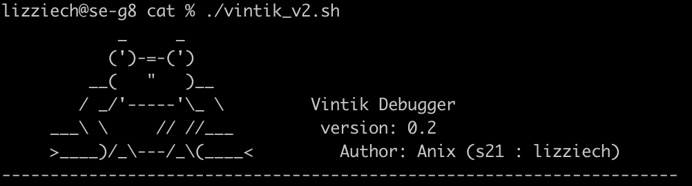

# Vintik



Vintik - простая в использовании и очень сложная в настройке программа, которая поможет вам отладить ваш проект без боли, особенно в School 21 )

**Преимущества vintik**:

 - Демонстрация только провальных тестов
 - Демонстрация тестов, которые у вас получилось исправить
 - Демонстрация тестов, в которых у вас появилась новая ошибка
 - Ведение логов с каждым тестом, ошибками, которые исправили и которые появились
 - Сбор статистики и создание простой диаграммы в HTML

**Недостатки vinitk**:

 - Он сравнивает вывод вашей программы с другой, а значит, для тестов, придется писать программу которая работает правильно
 - Тесты нужно генерировать самим
 - **Vinik** еще не обрел популярность(

## **Настройка vintik**:

Чтобы пользоваться этим лягушонком без вреда здоровью, необходимо сделать следующее:

- **На вашей системе должна быть английская локализация!** Вы пишите вывод программы на английском языке, а система будет выводить на не английском...
- Для простоты настройки, поместите **vintik** в каталог с вашей программой.

Откройте **vintik.sh**

```
name_of_program="./s21_cat"             # Путь до вашей программы. Здесь вы вводите программу, которую хотите проверить. Если grep, то ./s21_grep
name_of_system_program="cat"            # Путь до рабочей программы. Программа, с которой вы сравниваете. Если grep, то grep
file_with_test_params="tests.txt"       # Путь до файла с набором тестов. В этом файле находятся тесты, которые вы будете прогонять в программе
path_to_save_logs="test_logs"           # Путь до папки, в которой все результаты. Название каталога, который создаст vintik. В нем будут лежать все результаты
```

В файле тестов должны быть только аргументы для тестирования. 

Не это:

```
cat -v 123.txt
cat -n t.txt
```

А это:

```
-v 123.txt
-n t.txt
```

**Все! Настройка завершена!**

## **Запуск vintik**

 - ```chmod +x файл_винтика ```
 - ```./файл_винтика```

## **Архитектура каталога vintik**

 - **failed_test**  - здесь находятся все логи с провальным тестами
   - __.log - файл с логом. Каждому тесту соответствует свой лог
 
 - **fixed_mistake.log** - тесты, которые у вас получилось исправить
   
 - **list_of_fail_args_old.log** - провальные тесты на прошлой проверке
   
 - **list_of_fail_args.log** - провальные тесты на текущей проверке
   
 - **need_correct.log** - провальные тесты, которые у вас не получилось исправить
   
 - **new_mistake.log** - новые провальные тесты, которые появились из-за того, что в вашей программе вы что-то не так написали)
   
 - **statistic** - каталог с HTML страницей и статистикой
    - **index.html** - HTML страница с диаграммой и статистикой
    - **stats.txt** -  Статистика


## **В разработке**
 - Тестирование на утечки в каждом тесте **leaks**
 - Проверка на стиль **clang-format** , **cppcheck**
 - Переработка дизайна HTML страницы
 - Создание setup.sh, который сделает конфиг, спрашивая у пользователя нужные данные
 - Переделать корявый код) Как обычно

**Надеюсь вам помог vintik! Если хотите его улучшить и сделать жизнь проще и счастливей - пишите!) <3**
